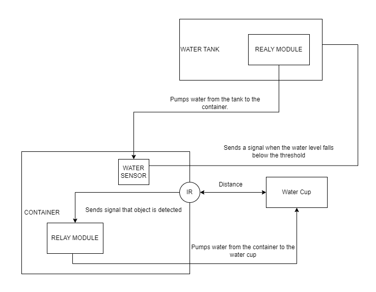
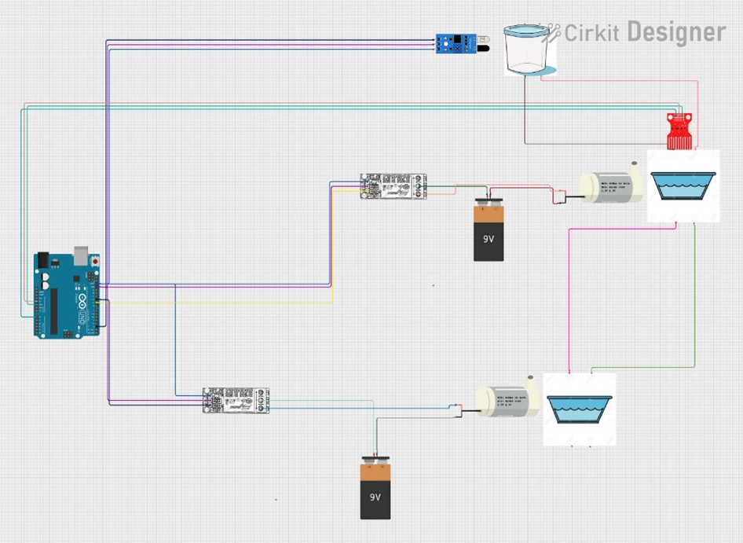
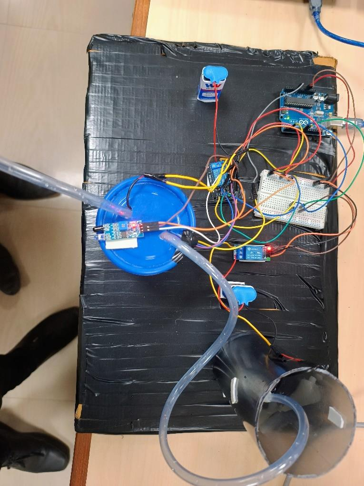
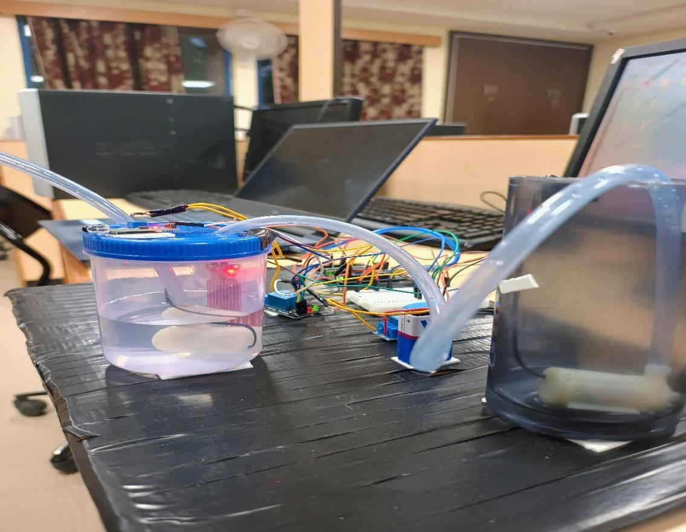

# Automatic Water Dispenser

An IoT-enabled system designed to automate water dispensing and refilling using Arduino, IR sensors, and water level sensors. This project ensures efficient water management by eliminating manual intervention, making it suitable for household, industrial, and agricultural applications.

---

## Project Overview

The **Automatic Water Dispenser** automates the process of dispensing water when needed and refilling the water container when it reaches a low threshold. The system uses an **IR sensor** to detect a water cup's presence and a **water level sensor** to monitor the water levels in the container. When the water level drops, a pump is activated to refill the container automatically.

---

## Features

- **Automatic Water Dispensing**: Detects the presence of a cup and dispenses water.
- **Real-time Monitoring**: Continuously monitors water levels in the container.
- **Smart Refilling**: Automatically refills the container when the water level drops below the threshold.
- **IoT Integration**: Arduino-based system with simple yet effective automation.
- **Cost-effective Design**: Uses readily available hardware components.

---

## Objectives

1. Automate the water dispensing process using an IR sensor.
2. Use a water level sensor to monitor container levels and trigger refilling when needed.
3. Prevent water wastage through precise dispensing and refilling.
4. Provide a scalable, cost-effective solution for various applications.

---

## Hardware Requirements

- **Arduino Uno**: Microcontroller for processing sensor data.
- **IR Sensor**: Detects the presence of a water cup.
- **Water Level Sensor**: Monitors water levels in the container.
- **Relay Module**: Controls the pump for water dispensing and refilling.
- **Water Pump**: Pumps water between the main reservoir and the container.
- **Other Components**: Jumper wires, breadboard, power supply, two water containers.

---

## Software Requirements

- **Arduino IDE**: For writing and uploading the code to the Arduino board.
- **Programming Language**: Arduino C/C++.

---

## Setup and Usage

1. **Hardware Setup**:
   - Connect the sensors and relay module to the Arduino Uno as per the circuit diagram.
   - Ensure the water containers are properly connected to the pump.

2. **Software Setup**:
   - Install the Arduino IDE on your computer.
   - Open the provided `.ino` file in the IDE and upload it to the Arduino Uno.

3. **Run the System**:
   - Power the Arduino board and observe the system automatically dispensing water when a cup is detected.
   - Monitor the water level through the sensor and watch the automatic refilling process.

---

## Results

- **Efficient Water Dispensing**: Automatically dispenses water only when needed.
- **Reliable Refilling**: Maintains optimal water levels in the container without overflow.
- **Hands-Free Operation**: Eliminates manual intervention, making the system user-friendly.

---

## Project Visuals

### Block Diagram


### Circuit Diagram


### Project Pictures



---

## Project Structure

```
Automatic-Water-Dispenser/
│── hardware/                      # Contains hardware schematics and diagrams
│   │── block_diagram.png
│   │── circuit_diagram.png
│   │── arduino_uno_diagram.png
│   │── water_sensor_diagram.png
│   │── ir_sensor_diagram.png
│   │── relay_module_diagram.png
│── src/                           # Source code directory
│   │── main.ino                   # Arduino source code
│── docs/                          # Documentation files
│   │── awd_report.pdf             # Mini project report
│   │── README.md                  # Project documentation
│── images/                        # Project images and screenshots
│   │── project_picture1.png
│   │── project_picture2.png
│── test/                          # Test scripts
│   │── test_water_sensor.ino
│   │── test_ir_sensor.ino
│── .gitignore                     # Ignore compiled files and temp files
│── LICENSE                        # Open-source license (MIT, Apache, etc.)
│── README.md                      # Overview and setup instructions
```

---

## References

- [Arduino Uno Documentation](https://www.arduino.cc/en/Guide/ArduinoUno)
- [IR Sensor Tutorial](https://www.tutorialspoint.com/arduino/arduino_ir_sensor.htm)
- [Water Level Sensor Guide](https://www.circuitdigest.com/tutorial/water-level-sensor-arduino-tutorial)

---

## Contributors
- **[Abhishek S](https://github.com/Abishek9342)**
- **[Manoj S](https://github.com/Jonam-2004)**
- **[Prasanna Venkatesh S](https://github.com/anna123venkat)**

